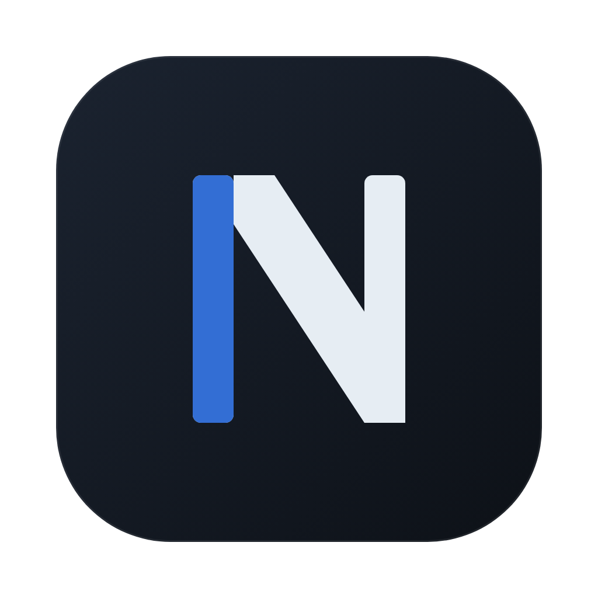
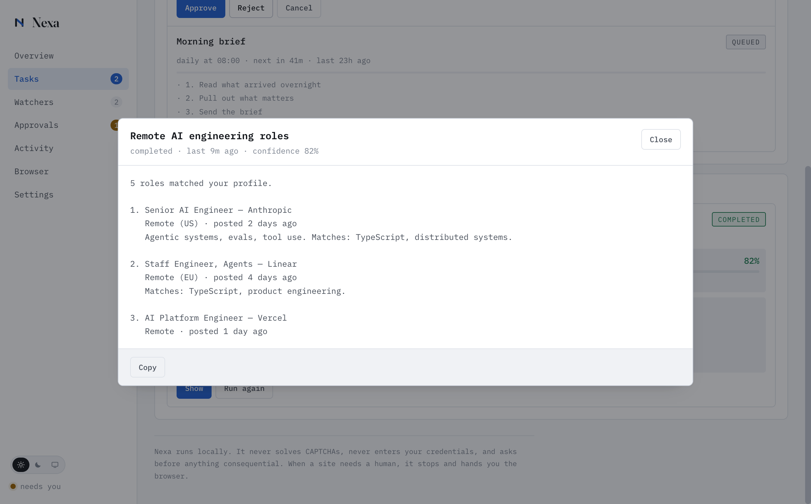
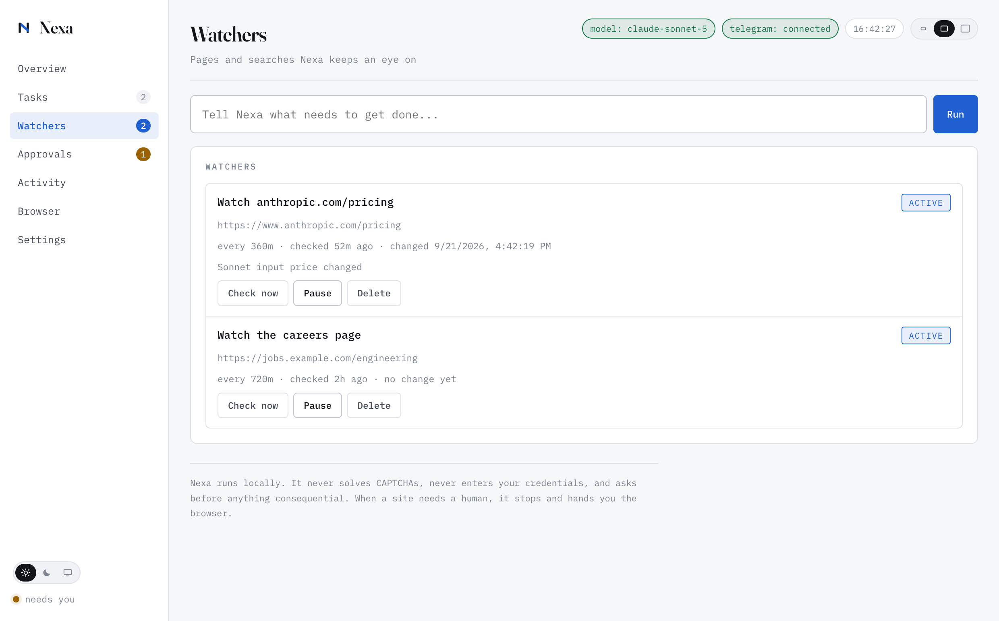

<div align="center">



# Nexa

**Your AI operations agent.** Tell Nexa what you need, and it researches,
monitors websites, runs browser workflows, manages recurring tasks, reads your
mail and calendar, drives other apps, and reports back.

Nexa is not a chat window. It plans, acts, verifies and reports.

[Getting started](docs/GETTING-STARTED.md) ·
[Security](#security) ·
[Adding a tool](#making-nexa-do-a-new-thing) ·
[hello@kodefoundry.com](mailto:hello@kodefoundry.com)


</div>

```
You:   Find 5 remote AI engineering jobs that match my profile.
Nexa:  Task created: remote AI engineering jobs
       Plan (AI-planned):
       1. Search for roles matching your profile
       2. Rank them against your skills and salary floor
       3. Send the shortlist
       I will report back when it is done.
```

macOS · runs entirely on your machine · MIT licensed

---

## See it work

| | |
|---|---|
| **Everything at a glance** — what is running, what needs you, what changed |  |
| **Every result, in full** — with the evidence and a confidence score |  |
| **Watchers** — pages and searches checked on a schedule, reporting only meaningful change |  |
| **Nothing consequential without you** — anything that changes the world outside Nexa waits |  |
| **Off until you say so** — every capability, and the allow-lists that bound it |  |

---

## What it does

- **Understands a request** in plain language, from the desktop app or Telegram.
- **Plans** it into concrete steps with a named tool for each one.
- **Acts**: searches the web, reads pages, drives a real browser, reads approved folders,
  and once you turn them on, puts events in your calendar, saves notes, and writes mail.
- **Watches** pages and searches on a schedule, reporting only meaningful change.
- **Asks** before anything consequential, and stops for a human when a site does.
- **Reports** with evidence: URLs, timestamps, screenshots, extracted data.
- **Survives restarts**: tasks, schedules and watchers are on disk, not in memory.

### What it will not do

- Solve or bypass CAPTCHAs, Cloudflare challenges or any other human check.
- Enter your passwords. When a site needs a login, it hands you the browser.
- Read outside the folders you have explicitly allowed.
- Buy, order or pay for anything, or submit applications and forms as you. Those are
  refusals by policy, not gaps: no tool you add unlocks them.
- Send mail, unless you switch sending on yourself. It drafts by default and leaves
  the message in Drafts for you to read and send.
- Claim something was done when it was not.

When a page needs a person, the task moves to `WAITING_FOR_HUMAN`, Nexa screenshots
the state, messages you, and waits. You finish the step, press **Resume**, and it
carries on from where it stopped.

---

## Making Nexa do a new thing

Every capability is a `Tool` (`src/tools/Tool.ts`). Adding one is three steps,
and `CalendarTool` is the worked example to copy.

1. **Write the tool.** Implement `Tool`: a tight `inputSchema`, the
   `permissions` it needs, and `mutating: true` if it changes anything outside
   Nexa. That flag alone routes it through the approval gate.
2. **Register it** in `NexaAgent.registerTools()`, or point Nexa at an MCP
   server in `config.json` and its tools register themselves.
3. **Nothing else.** The planner is handed the catalogue, the refusal message
   rebuilds itself from what is registered, and the permission check applies
   the same way it does to a built-in.

Requests Nexa has no tool for are refused rather than quietly downgraded into a
web search (`Planner.detectUnsupported`). "Check my mail" is the case that made
this matter: before the guard covered it, that request came back COMPLETED
carrying a Google result for Gmail. That guard is keyed to tool names, so
registering a calendar tool lifts the refusal for calendar requests and nothing
else. The refusal also survives a plan that *could* have used the tool and did
not: if the plan for "book the dentist" comes back as a web search, Nexa
declines instead of reporting a search as a booking.

Capabilities come in two kinds. Most are about acting, so only a tool that
changes something can satisfy them, which stops a search tool that happens to
mention "events" from looking like a way to book one. Reading a mailbox is the
other kind: the tool that answers it is read-only by design.

Two capabilities are never unlocked by any tool: **purchasing** and **form
submission**. Those are policy.

### Calendar, Notes and Mail

All three are macOS only and all three are off by default. Turn them on under
**Settings > Agent behaviour**. They drive the apps you already use, so a Gmail
or Outlook account set up in Mail, or a Google calendar subscribed in Calendar,
works without Nexa ever holding a token of its own.

The first use of each triggers a macOS prompt to let Nexa control that app.
Until you answer it, the task parks in `WAITING_FOR_HUMAN` with instructions
rather than failing silently.

They share one implementation shape, in `src/tools/applescript.ts`:

- Values reach AppleScript as `argv`, never spliced into the script text. There
  is no subject line or note body that can change what a script does.
- Writes are idempotent on a natural key (event title plus start time, note
  title), so a retry after a timeout finds what it already made rather than
  creating a second copy.
- Two ordered timeouts, so a hung app surfaces as an explainable AppleScript
  error rather than a killed process.

**Mail is two tools, not one.** `mail_read` opens the inbox and is read-only,
so "check my mail" runs without an approval prompt and carries its own
`MAIL_READ` grant: a task allowed to draft a reply is not thereby allowed to
read everything that ever arrived.

Reading walks each account's own inbox, newest first, and stops at the first
message outside the window. It deliberately does not touch Mail's unified
inbox: that is a concatenation of every account, so it is not in date order,
and it is enormous.

**Reading mail is slow, so it is bounded by time rather than by hope.** Mail
costs seconds per message on a large Exchange account, and `with timeout` in
AppleScript bounds a single Apple event, not a loop of hundreds of them -- so a
big request used to run past every limit and die with `Command failed:
/usr/bin/osascript`, returning nothing. The script now carries its own deadline
(`maxSeconds`), stops itself when it runs out, and returns the newest messages
it managed to read, saying plainly that the list is partial. Previews cost an
extra fetch each and are capped well below the message limit for the same
reason.

**With several accounts, Nexa asks which one** before doing the work, offering
them as one-click answers, unless the request already says ("check my outlook")
or a default is set under Settings. That is worth the question twice over: four
inboxes answer "what came in today" four different ways, and naming one is also
about 24x faster than reading them all.

**Writing mail drafts by default.** Sending needs a second switch, because
drafting is recoverable and sending is not. With sending off, asking Nexa to
send is refused outright rather than quietly downgraded to a draft: believing a
mail went out when it did not is worse than being told no.

### MCP servers

`config.json` ships a catalogue of servers, all `enabled: false`. Nothing
spawns until you turn one on.

Two of them are real, official packages: `@modelcontextprotocol/server-filesystem`
(adds writing files, which the built-in file tool deliberately does not do) and
`@modelcontextprotocol/server-memory`.

The Gmail, Outlook and Google Calendar entries are **placeholders with no
package filled in**. There is no official MCP server for any of them. If you
want one, pick a community server whose source you have read and put it in the
`command`/`args` yourself, because an enabled server runs on every app launch.
For most people the built-in mail and calendar tools already cover these
accounts through the macOS apps, with no server at all.

---

## Architecture

```
            You  (desktop UI / Telegram)
             |
        NexaAgent            orchestration, one entry point for every request
             |
          Planner            language -> plan (LLM, with a rule-based fallback)
             |
   TaskEngine   WatcherEngine   state machines, retries, scheduling, recovery
             |
        ToolRegistry         permission-checked capabilities
             |
  web_research  browser  watcher  analyze  files  calendar  notes
  mail  mail_read  notify
             |
      Evidence + Results -> desktop + Telegram
```

```
src/
  agent/        NexaAgent (orchestrator), Planner, ActivityLog
  tasks/        Task model + state machine, TaskEngine
  watchers/     Watcher model + change detection, WatcherEngine
  tools/        Tool interface, registry, and the six built-in tools
  llm/          Provider interface, Anthropic, OpenAI-compatible, null
  browser/      BrowserManager (profiles, locking), ChallengeDetector
  mcp/          MCP client (JSON-RPC over stdio) and tool adapter
  telegram/     TelegramBot: long polling, commands, inline buttons
  notifications/ Telegram, desktop, sound
  evidence/     Screenshots and captured payloads
  storage/      Durable JSON stores
  config/       Zod schema, config and secret handling
  main/         Electron main process, IPC, preload
  ui/           Dashboard (plain HTML/CSS/JS, context-isolated)
  cli/          agent, doctor, test:telegram
```

Design decisions worth knowing:

- **The task state machine is real.** Every transition is declared and checked;
  an illegal one throws rather than corrupting state. Crash recovery is an
  explicit `RUNNING -> QUEUED` edge, not a silent reset.
- **Permissions are per task.** A tool declares what it needs (`RESEARCH`,
  `BROWSER`, `FILES`, `NOTIFY`, `EXECUTE`); the engine refuses any step whose
  tool asks for more than the task was granted. The model choosing a tool cannot
  widen its own access.
- **Nexa yields to you.** It watches for navigations and form posts it did not
  make. While you are using the browser, scheduled work waits instead of
  navigating the page out from under you.
- **One browser profile, one process.** A PID lock stops two instances sharing a
  profile directory, which would otherwise log each other out of sites.
- **No provider, no problem.** Without an API key the planner falls back to rules
  and the app still creates watchers, runs schedules and drives browsers.

---

## Installation

Requires **Node.js 20.10+**.

```bash
cd nexa
npm install          # also runs "playwright install chromium"
cp .env.example .env
npm run dev          # build and open the app
```

`config.json` is created from `config.example.json` on first run.

---

## Environment variables

Secrets live in `.env` (owner-only, gitignored) and never in `config.json`.

| Variable | Purpose |
| --- | --- |
| `TELEGRAM_BOT_TOKEN` | Bot token from @BotFather |
| `TELEGRAM_CHAT_ID` | Your numeric chat id; **only this chat may command Nexa** |
| `ANTHROPIC_API_KEY` | Anthropic provider |
| `OPENAI_API_KEY` | OpenAI or any compatible server |
| `OPENAI_BASE_URL` | Base URL for Ollama, vLLM, LM Studio, … |
| (per server) | MCP servers may need their own tokens; set them in that server's `env` block in `config.json` |
| `LOG_LEVEL` | `trace` … `fatal`, default `info` |

All of these can also be set from **Settings** in the app, which writes them to
`.env` with `chmod 600`. They are never displayed again and never logged.

---

## AI provider setup

Settings → AI provider. Pick Anthropic or an OpenAI-compatible endpoint, set a
model, paste a key.

The provider is used for planning, tool selection, ranking, summarising and
writing reports. Without one, Nexa plans with rules: it still handles "watch
this page", "research X", "do it every morning", and browser workflows, but
loses free-form phrasing and model-quality summaries. `npm run doctor` tells you
which mode you are in.

---

## Telegram setup

1. Message [@BotFather](https://t.me/BotFather), send `/newbot`, copy the token.
2. Message [@userinfobot](https://t.me/userinfobot) for your numeric chat id.
3. Send your own bot one message so it is allowed to write to you.
4. Paste both into Settings → Telegram and press **Save and verify**.

Telegram then becomes a full remote control:

```
Find 5 interesting remote AI jobs and send me the results.
Do that every morning at 8am.
Watch https://example.com/pricing and tell me when it changes.
Show me my active tasks.
Pause the job search.
Resume it.
Stop everything.
```

Commands also work: `/start /help /status /tasks /watches /pause /resume /cancel`.

Approvals and takeovers arrive as inline buttons: **Approve / Reject**, or
**Open browser / Resume / Cancel**.

Messages from any chat id other than yours are refused.

---

## MCP servers: borrowing capabilities

Nexa is an MCP client. Any [Model Context Protocol](https://modelcontextprotocol.io)
server becomes a set of Nexa tools, which is how it reaches things it does not
implement itself: your filesystem, git, databases, issue trackers, Slack.

Add them to `config.json` and restart:

```json
{
  "mcpServers": [
    {
      "id": "files",
      "name": "Filesystem",
      "command": "npx",
      "args": ["-y", "@modelcontextprotocol/server-filesystem", "/Users/you/Documents"],
      "permissions": ["FILES"]
    },
    {
      "id": "git",
      "name": "Git",
      "command": "uvx",
      "args": ["mcp-server-git", "--repository", "/Users/you/code/project"],
      "permissions": ["FILES", "EXECUTE"]
    }
  ]
}
```

Their tools appear to the planner as `mcp_<server>_<tool>` and are usable in any
task. Settings → MCP servers shows what connected and how many tools each
contributed.

**The safety model does not loosen for them:**

- Each server runs under the `permissions` you grant it. A filesystem server
  given `FILES` cannot drive the browser, whatever its tools claim.
- A tool is assumed to **write** unless the server explicitly marks it
  read-only, so it goes through the approval gate. Guessing "harmless" would
  quietly skip the prompt.
- The command and arguments come from `config.json` only. Nothing the model
  produces is ever executed as a shell command; it can only call tools a
  server already advertises.
- A server that dies or times out fails that step. It cannot hang a task.

Verified against the official filesystem server: 14 tools discovered, schema
converted, `read_file` correctly detected as read-only, call executed and
content returned.

---

## How agentic is it?

Nexa plans, acts, and then **checks its own work**:

1. The planner turns your request into steps, choosing from every registered
   tool, MCP ones included.
2. The engine runs them, retrying transient failures and stopping for a human
   when a site or a consequential step needs one.
3. Before a task is called done, the agent reviews what it actually got against
   what you asked for. If the result clearly misses, it appends up to three
   more steps and continues.

That last part is bounded on purpose (`maxAdaptiveSteps`, and only with a model
configured). An agent that can extend its own plan without limit is one that
runs up a bill and never finishes.

What it will not do is pretend. A request needing a capability Nexa lacks is
refused with the gap named, rather than quietly degraded into a web search.

---

## Keeping it running

Nexa only works while it is open, so a watcher due every six hours needs the
app to actually be there. Two independent mechanisms, use either or both:

**Start at login** (Settings → Agent behaviour → Running in the background).
Uses the system login item. Requires the packaged app, since an unpackaged run
would register the Electron binary rather than Nexa.

**Restart if it stops**, which is what a scheduler really needs:

```bash
npm run autostart          # install a LaunchAgent (macOS)
npm run autostart:status   # is it installed and running?
npm run autostart:remove   # undo
```

The LaunchAgent sets `RunAtLoad` and `KeepAlive`, prefers the packaged app and
falls back to the dev build, and throttles restarts to every 30s so a startup
failure cannot spin. Verified by killing the process: launchd brought it back
with a new pid.

**Staying awake.** While work is pending, Nexa takes a
`prevent-app-suspension` power blocker so macOS does not throttle it into
uselessness, and releases it the moment things go quiet, so idling costs
nothing.

**What this does not do:** keep your Mac awake. A closed lid still sleeps and
nothing runs. Anything that came due in the meantime fires on the next tick
after wake, because due work is decided by comparing timestamps rather than by
a timer that has to have been running. If you need genuine 24/7, that is the
point to put the headless agent (`npm run agent`, no Electron needed) on a
machine that stays up.

---

## Browser profiles

Each profile is a separate persistent browser session with its own cookies,
stored under `data/profiles/<id>/`. Sign in once in a profile and later tasks
reuse that session.

Nexa runs stock Chromium with no stealth plugins and no fingerprint patching.
When a site blocks automation, that is treated as a signal to ask you, not a
problem to engineer around.

---

## Task examples

| Ask | What Nexa builds |
| --- | --- |
| "Research the latest AI agent frameworks and summarise" | search → analyse → report |
| "Find 5 remote AI jobs that match my profile" | search (profile-aware) → rank → report |
| "Watch example.com/pricing and tell me when it changes" | watcher, every 6h, keyword-filtered |
| "Open example.com every Friday and send me the headlines" | browser workflow, weekly |
| "Summarise new documents in my notes folder" | file scan → analyse → report |
| "Every morning at 8am send me an AI news brief" | recurring research task |

Your profile (Settings → Your profile) feeds the career and learning tasks:
skills, technologies, preferred and excluded roles, remote preference, salary
floor. Nothing is hard-coded.

---

## Watcher examples

A watcher stores a normalised snapshot and compares future readings against it.

It **ignores**: timestamps, relative times ("5 minutes ago"), session ids,
UUIDs, hashes and cache-busting query strings. It **reports**: genuine content
changes, optionally filtered to keywords so an unrelated edit on a busy page
stays quiet.

```
watch https://example.com/pricing and tell me when the price changes
```

First check is a baseline, never an alert. The interval floor
(`agent.minWatchIntervalSeconds`, default 300s) applies to every watcher, and an
over-eager request is raised to it rather than accepted.

---

## Security

Nexa holds credentials that can spend money and read your mail, and it drives
apps that hold everything else.

**Secrets are encrypted at rest.** The API key and Telegram token are stored
through the OS keychain (Electron's `safeStorage`), so the file on disk is
ciphertext rather than readable text. `npm run doctor` reports which mode is
active. The CLI entry points run outside Electron and have no keychain, so
they fall back to a `0600` plaintext file; a hand-written `.env` keeps working
and is still read first. Secrets are never echoed back to the UI.

**The app is signed** with a Developer ID certificate and runs under the
hardened runtime. The entitlement that matters is
`com.apple.security.automation.apple-events`: without it the hardened runtime
blocks the calendar, notes and mail tools while leaving everything else
working, which is a confusing way to fail. Notarization is a separate step:

```
xcrun notarytool store-credentials notarytool \
  --apple-id you@example.com --team-id YOURTEAMID --password <app-specific-password>
```

Then set `"notarize": true` under `build.mac`. Until that is done the app is
signed but not notarized, so a first launch on another Mac needs
right-click > Open.

The rest:

- Telegram is restricted to your chat id; anything else is refused and logged.
- The logger redacts passwords, tokens, cookies, API keys and OTPs at every
  nesting level; URLs are logged with query strings stripped.
- The file tool refuses any path outside your allowed folders, traversal
  included, and declines binary formats rather than returning garbage.
- Tasks carry explicit permissions; a tool needing more is refused. Reading
  mail and writing mail are separate grants.
- Mutating steps require approval when `requireApprovalForWrites` is on, and
  sending mail needs a second switch beyond that.
- Values reach AppleScript as `argv`, never spliced into the script text, so
  no subject line or note body can change what a script does.
- The renderer runs with context isolation, no Node integration, and a strict
  CSP (`default-src 'none'`). Its only capability is the IPC surface in
  `src/main/preload.ts`, and evidence files open only from Nexa's own directory.

---

## Demo mode

Settings → Agent behaviour → Demo mode. Nexa plans and executes exactly as
usual, but research and browser steps are simulated locally and **every result is
labelled `[SIMULATED]`**. Nothing is contacted.

It exists to demonstrate the whole flow — natural-language task creation,
planning, execution, analysis, notification, approval, takeover, history and
evidence — without depending on the network. Simulated output is never presented
as real.

---

## Development

```bash
npm run dev           # build and launch the desktop app
npm run build         # compile TypeScript, copy UI assets
npm start             # launch from an existing build
npm run agent -- "…"  # run one request headlessly, follow it to completion
npm run doctor        # what is configured, what is missing
npm run autostart     # keep Nexa running across logins and crashes (macOS)
npm run test          # unit tests (no network)
npm run lint          # ESLint
npm run typecheck     # tsc --noEmit
npm run package       # build a distributable desktop app into release/
```

Adding a tool is the main extension point: implement the `Tool` interface
(`name`, `description`, `inputSchema`, `permissions`, `mutating`, `execute`) and
register it in `NexaAgent.registerTools()`. The planner picks it up
automatically, because its catalogue is generated from the registry.

---

## Testing

```bash
npm test
```

99 tests across the task state machine, recurrence maths, watcher change
detection and noise filtering, the planner (control intents, rule planning,
schedule parsing), the task engine (retries, approvals, takeover, permission
refusal, crash recovery), the tool registry, the file sandbox, Telegram
send/receive/button handling and token redaction, MCP schema conversion,
permission inheritance and error handling, page-boilerplate stripping and
extractive summarisation, and JSON extraction from model output.

Tests run against a scratch data directory and stubbed network. **No test
contacts the internet.**

The restart scenario is covered explicitly: create a task, simulate a crash
mid-run, build a fresh engine over the same files, confirm the task survived,
was requeued, and then completes.

---

## Roadmap

**Now**: task engine, orchestrator, watchers, browser workflows, Telegram
control, approvals, human takeover, evidence, persistence, demo mode.

**Next**: richer file intelligence (PDF and DOCX), agent memory across tasks,
multiple concurrent tasks, more watcher types, a daily briefing digest.

**Later**: the architecture is deliberately local-first, but the layering
(agent → engines → tools) is designed so execution could move to a remote
worker, with multiple users and shared workflows, without rewriting the core.

---

## Contact

- **Bugs and features** — [GitHub issues](https://github.com/josephhamawi/nexa/issues)
- **Everything else, including security reports** — hello@kodefoundry.com

Please report security issues by email rather than in a public issue.

---

Built by [Kode Foundry](mailto:hello@kodefoundry.com). MIT licensed — see
[LICENSE](LICENSE).
