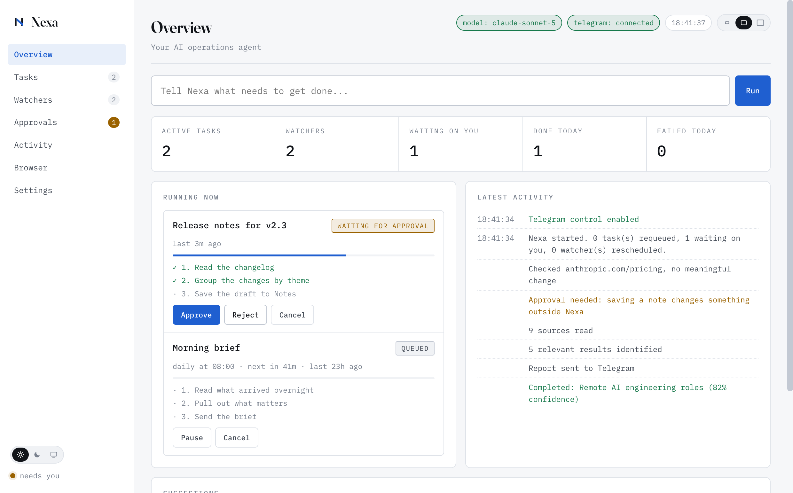
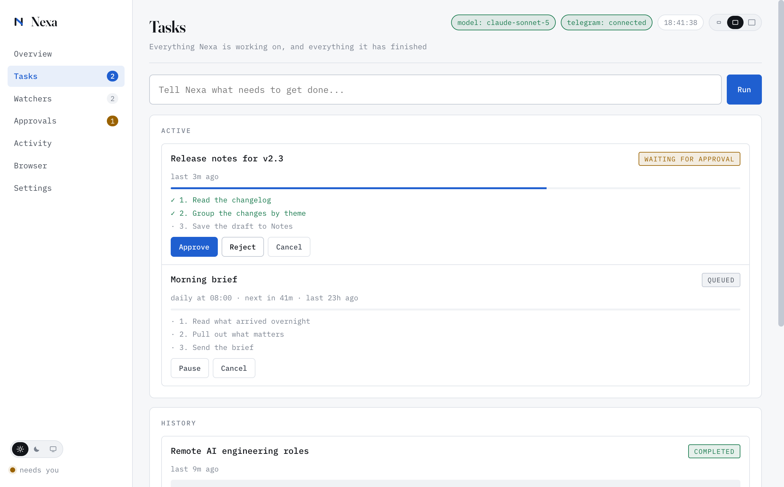
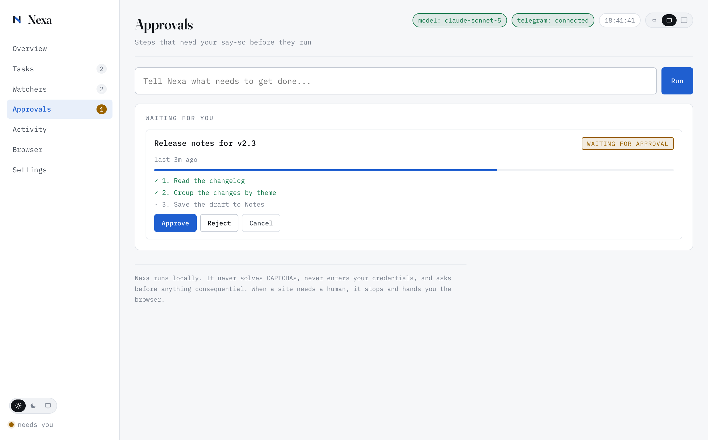
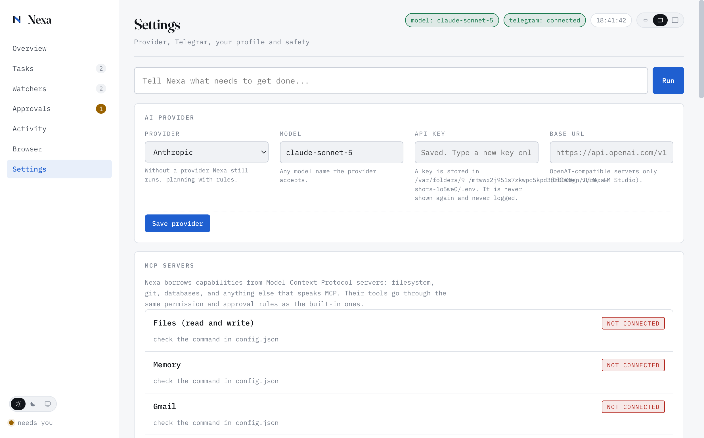

# Getting started with Nexa

Nexa is a desktop agent for macOS. You tell it what you need; it plans the
work, does it, and reports back with evidence. Everything runs on your own
machine.

This guide takes about ten minutes, and you can stop after step 3 with
something useful.

---

## 1. Install

### From a release

1. Download `Nexa-1.0.0.dmg` from the
   [releases page](https://github.com/josephhamawi/nexa/releases).
2. Open the DMG and drag **Nexa** to Applications.
3. The first launch needs **right-click → Open** rather than a double-click.

That right-click is not a workaround for a broken app: it is macOS asking
whether you trust a developer it has not seen before. Nexa is signed with a
Developer ID certificate but is not yet notarized, and Gatekeeper treats those
differently. You only do it once.

### From source

Requires Node 20 or newer and macOS.

```bash
git clone https://github.com/josephhamawi/nexa.git
cd nexa
npm install
npm run dev
```

---

## 2. Point it at a model

Nexa runs without one, planning with rules instead, and it will tell you so in
the header: **model: rules only**. That is genuinely usable for watching pages
and simple research, but plans are better with a model.

1. Get a key from [platform.claude.com](https://platform.claude.com).
2. Open **Settings → AI provider**, paste it in, press **Save provider**.

The key is encrypted with your login keychain, not stored as readable text.

**On cost.** Nexa is deliberately frugal: the tool catalogue it sends on every
planning call is cached, so repeat calls pay about a tenth for that part. A
typical task costs a few cents on Claude Sonnet 5 and under two on Haiku 4.5.
Pick the model under **Settings → AI provider**; `effort` trades cost against
the quality of a plan.

---

## 3. Ask for something

Type into the box at the top and press **Run**.



Things that work immediately, with no further setup:

```
research the latest AI agent frameworks
watch example.com and tell me when it changes
find 5 remote AI engineering jobs that match my profile
```

Nexa shows you the plan before it starts, and reports with the URLs,
timestamps and screenshots it actually used.



Anything that changes something outside Nexa waits for you first.



**It will also tell you when it cannot do something at all**, rather than
quietly substituting a web search for the thing you asked for, which looks
exactly like it is working.

---

## 4. Turn on what you want it to touch

Everything that reaches outside Nexa is off until you switch it on, in
**Settings → Agent behaviour**.



| Switch | What it allows | Notes |
|---|---|---|
| **Calendar** | Creating events | Name the calendar events land in |
| **Notes** | Saving notes | Name the folder |
| **Mail** | Reading the inbox, writing drafts | Sending is a second, separate switch |
| **Run commands** | Running programs you list | Named programs only, never a shell |
| **Control other apps** | Driving apps you list | The broadest one; list sparingly |
| **Folders Nexa may read** | Reading files | Nothing outside the list is readable |

The first use of calendar, notes or mail triggers a macOS permission prompt.
Until you answer it the task waits rather than failing, and tells you why.

**On allow-lists.** Turning a switch on is not enough on its own: the command
and app lists start empty, so nothing runs until you name it. This is
deliberate. Nexa reads email and web pages, which is text other people write,
and an agent that runs whatever it is handed is a much worse idea than it
first appears.

---

## 5. Optional: control it from your phone

Telegram gives you Nexa from anywhere.

1. Message **@BotFather**, send `/newbot`, copy the token.
2. Paste it into **Settings → Telegram**.
3. Open your new bot and press **Start**. A bot cannot message you first.
4. Press **Detect**, and Nexa reads your chat ID from the bot.

Only your chat ID can command it. Anything else is refused and logged.

---

## Checking everything is set up

```bash
npm run doctor
```

It reports the browser, the model (including whether a real call succeeds:
a key that is present but rejected looks identical to a working one from
outside), Telegram, which capabilities are on, and whether secrets are
encrypted.

---

## Where your data lives

| | |
|---|---|
| Installed app | `~/Library/Application Support/nexa/` |
| From source | `./data/` in the repo |

Tasks, watchers, evidence and logs are files you can read and delete. Nothing
is uploaded anywhere. Everything is written owner-only.

To start completely fresh, quit Nexa and delete that folder.

---

## When something goes wrong

**"model: rules only" but I added a key.** Run `npm run doctor`. It makes a
real API call. A key that is present but rejected reports `ok` everywhere
except there.

**A mail or calendar task waits instead of finishing.** macOS is asking
whether Nexa may control that app. Answer the prompt and press **Resume**.

**A mail summary says it only read some of the messages.** That is true rather
than a bug. Reading is seconds per message on a large account, so Nexa stops
at a deadline and says the list is partial. Name one account to make it much
faster.

**The app will not open after downloading.** Right-click → Open (see step 1).

---

## Getting in touch

Bugs and feature requests:
[GitHub issues](https://github.com/josephhamawi/nexa/issues).

Anything else, including security reports: **hello@kodefoundry.com**.

If you are reporting something security-related, please use email rather than
a public issue, and include what you did and what happened.
